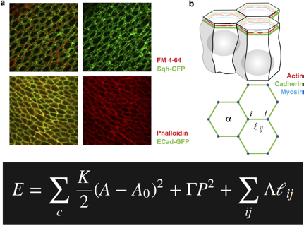
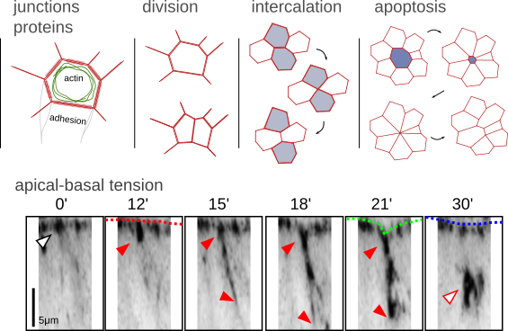
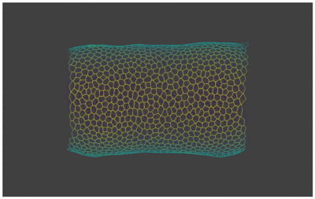
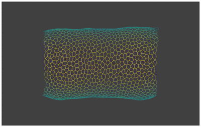
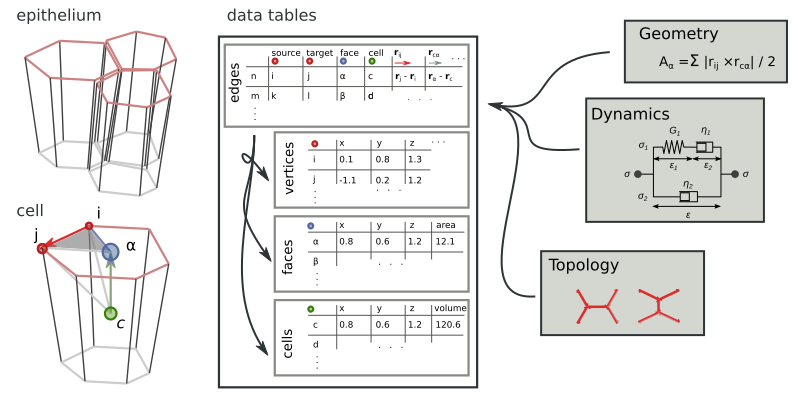
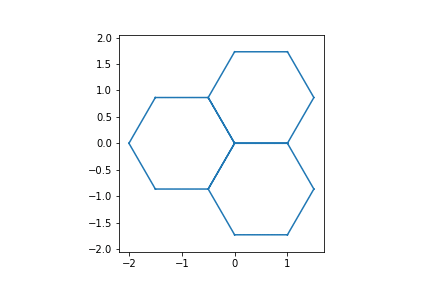
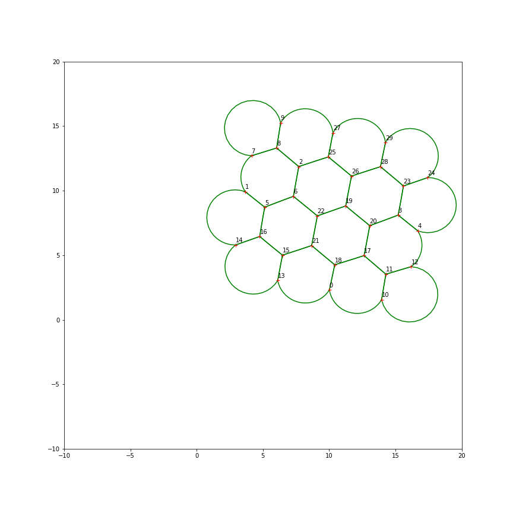
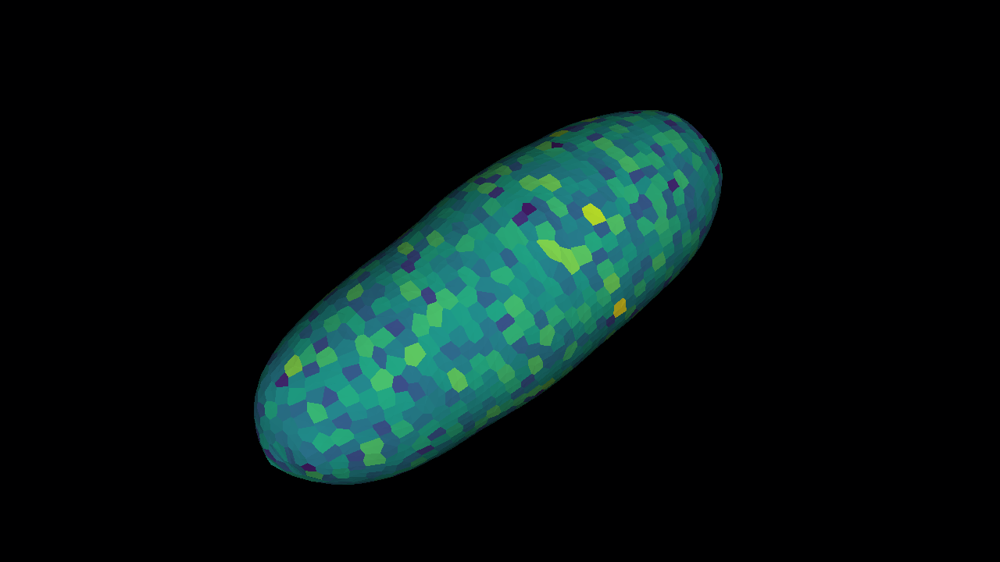
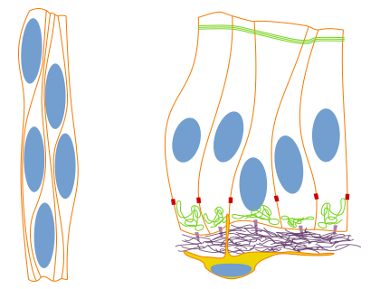

---
title: Tyssue, an epithelium modeling library
author: Guillaume Gay, Morphogénie Logiciels
susbtitle: 3rd Workshop Biofabrication & Cancer
date: Montpellier, 25 September 2019
logo: images/logo.png
fontsize: 11pt
width: 1080
height: 720
...

# Understanding epithelium mechanics at the cell level

## Epithelial morphogenesis

. . .

> Simple mechanics are often  enough

## Role of apoptosis in fold formation

##

:::::::::::::: {.columns}
::: {.column width="50%"}

:::
::: {.column width="50%"}

:::
::::::::::::::

. . .

> Single cell processes interact with tissue level mechanisms

# The `tyssue` library

## Design and architecture

. . .

> Modular design widens the range of applications

## A gallery

<table>
    <tr>
        <td> </td>
        <td>  </td>
    </tr>
    <tr>
        <td></td>
        <td></td>
    </tr>
</table>

## Open questions

. . .

> There's still work to do!

# Force inference and model fitting

## 2D segementation

* Detection method
* Model reconstruction

> Pretty standard methods

## Force inference and model fitting

* Method
* First results

>

## Perspectives

* Towards 3D

# a tool for tissue engineering

##

* Microscopy data to models
* Models as virtual experiments
* Models as parameter spaces
