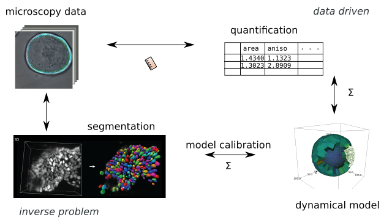

---
title: Tyssue, an epithelium modeling library
author: Guillaume Gay, Morphogénie Logiciels
susbtitle: 3rd Workshop Biofabrication & Cancer
date: Montpellier, 25 September 2019
logo: images/logo.png
fontsize: 11pt
width: 1080
height: 720
...

# Understanding epithelium mechanics at the cell level

## Epithelial morphogenesis

$$ E = \sum_c \frac{K}{2}(A - A_0)^2 + \Gamma P^2 + \sum_{ij} \Lambda \ell_{ij} $$

. . .

> Simple mechanics are often  enough

## Role of apoptosis in fold formation

:::::::::::::: {.columns}
::: {.column width="50%"}

:::
::: {.column width="50%"}

:::
::::::::::::::

##

:::::::::::::: {.columns}
::: {.column width="50%"}

:::
::: {.column width="50%"}

:::
::::::::::::::

. . .

> Modeling completes in vivo experiments

# The `tyssue` library

## Design and architecture

. . .

> Modular design widens the range of applications

## Good practices

. . .

> Open source, easy maintenance

## A gallery

##

{width=800}

##

{width=600}

##

##

##

# Force inference and model fitting

##

## 2D segementation

## Force inference and model fitting

. . .

> Actin / tension correlation

# Computer Assisted Tissue Engineering

## Perspectives

* Towards 3D with Julien Laussu

* Data enrichment with Deep learning

##

* Models as parameter spaces
* Models as virtual experiments

## Thank you!

:::::::::::::: {.columns}
::: {.column width="50%"}
* Sophie Theis
* Magali Suzanne & team
* Audrey Ferrand & team
* Florian Bugarin & team
:::
::: {.column width="50%"}
* Cyprien Gay
* Étienne Moisdon
* Édouard Hannezo
* Maxime Bouchard
:::
::::::::::::::
